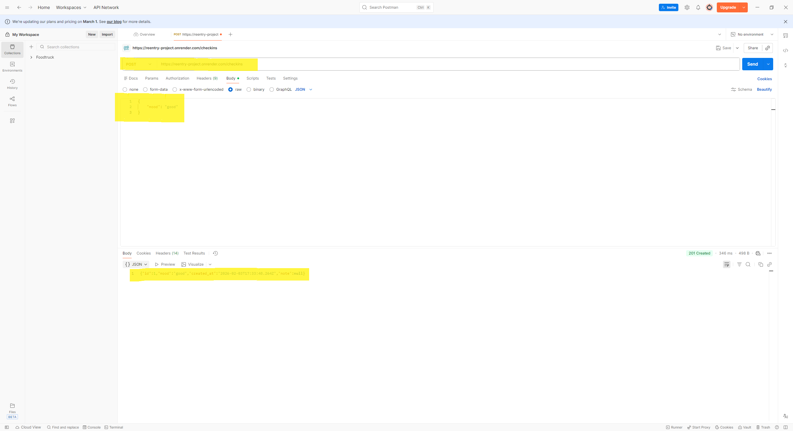
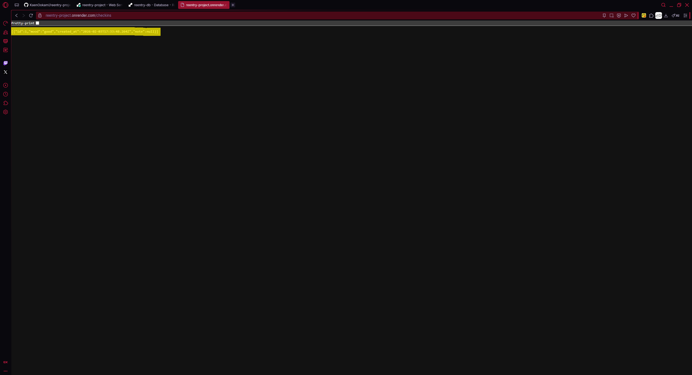
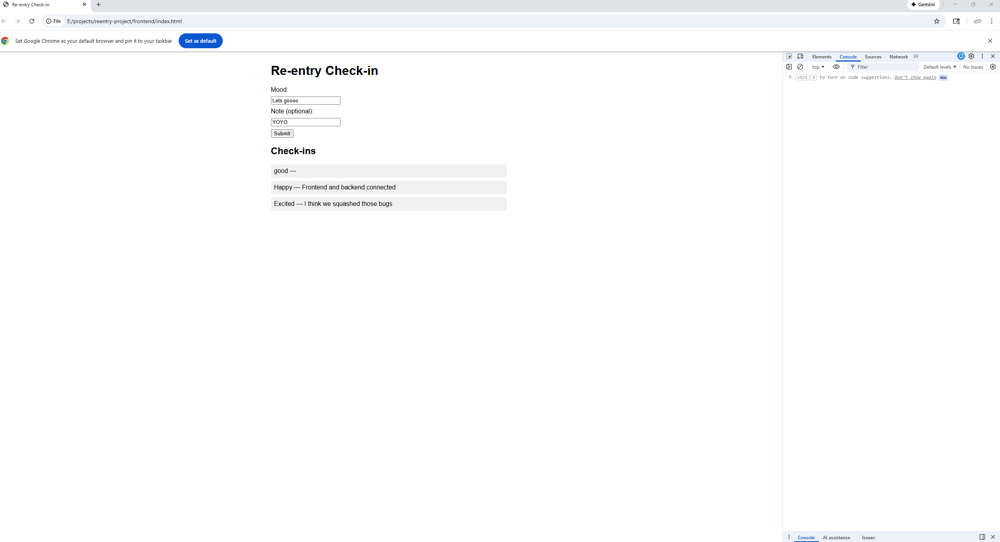

# Re-entry Project

## Day 1
- Environment setup
- Github repo created

## Day 2
- Ran first Node script
- Refreshed Git basics

## Day 3
- Created a basic Express server
- Added health check endpoint
- Ran server locally

## Day 4
- Created Postgres table and inserted daya
- Connected Express server to Postgres
- Added endpoint to fetch database records

## Day 5
- Added POST endpoint to create checkins
- Validated request body
- Inserted data into Postgres via API

## Day 6
- Added validation for POST '/checkins' (required 'mood")
- Implemented error handling for server & database
- Configured '.env' for PORT & DATABASE_URL
- Updated Postgres schema (added 'mood' column)
- Tested GET & POST routed end-to-end
- Fixed previous GitHub commits metadata

## Day 7
- Added .gitignore and removed enviroment secrets from version control
- Deployed Express backend to Render
- Provisioned managed Postgres database
- Connected production DB via environment variables
- Created checkins table with columns mood, note, created_at
-Verified live API endpoints with POST/GET

### Example POST request (Day 7)

### Example GET request (Day 7)

## Day 7 Part 2
- Built simple frontend for check-ins
- Connected frontend to live Render API
- Implemented POST and GET from browser
- Resolved CORS and DOM lifecycle issues

### Example Form & List (Day 7 Part 2)

## Day 8
- Deployed frontend as static site on Netlify
- Connected frontend to Render-hosted API
- Verified full-stack app works via public URL

### Live Demo
https://reentry-project.netlify.app/